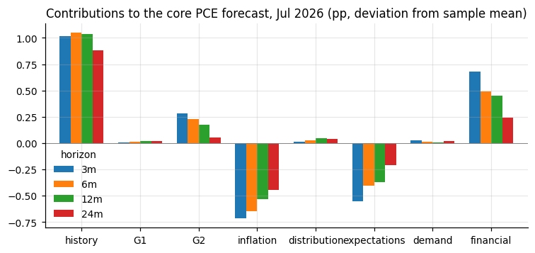
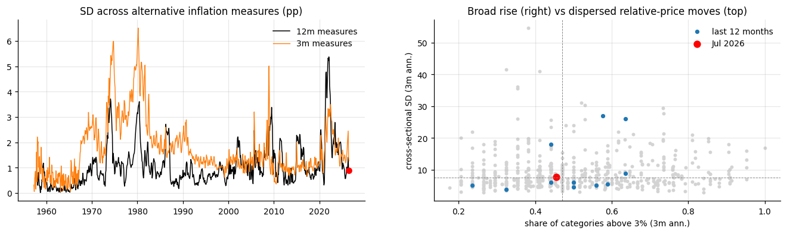

# US inflation signals: agreement, disagreement, and forecasting

Report generated September 08, 2026; data through September 2026.

**Summary**

- Core PCE runs at 3.3 percent over 12 months and 3.0 over 3 months; the median across eleven measures is 2.7, and 10 of 11 measures show 3m below 12m.
- The factor model projects 3.3 / 3.3 / 3.2 percent over 3/6/12 months, a change of -0.08 pp at 12 months; the probability of lower inflation over 12 months is 53% (normal approximation) to 75% (logit).
- Out of sample the factors do not beat inflation history (relative RMSFE 1.14 at 12 months); the distribution block is the only factor with a significant coefficient.
- Breadth: 56 percent of categories above 3 percent at 12 months (65th percentile), 45 percent at 3 months (45th).
- Financial conditions sit at the 75th percentile on the loose side; demand at the 35th; expectations are the outlier, with households +1.9 pp above professionals and SPF dispersion at the 95th percentile.
- Cross-block disagreement is at the 41st percentile; the closest analogs are 2014-03, 2006-03, 2004-04, 2007-07, after which core PCE changed by +0.09 pp (median) over 12 months.
- Current regime: adverse-supply-like (infl high, demand weak).

## Introduction

The question is what the current configuration of inflation-related indicators implies for future US inflation, how much the indicators agree or disagree with one another, and whether today's configuration resembles past episodes. The motivation is the current Fed debate, in which policymakers emphasize different statistics: recent inflation momentum, median and trimmed measures, the breadth of price increases, expectations, labor-market conditions, demand, and financial conditions.

All of these are treated as potentially useful signals for future inflation rather than sorted into 'measures of underlying inflation' and 'predictors'. A measure of underlying inflation is useful partly because it extracts the persistent, forecast-relevant component of current inflation, so the two roles are not distinct.

The approach has five steps. Predictors are organized into five blocks and each block is examined on its own. Two global factors are extracted from the full panel and one factor from each block's residual. Core PCE inflation is forecast at 3, 6, and 12 months with nested direct regressions. The current forecast is decomposed into contributions from inflation history and each factor, and forecast revisions are decomposed into news. Finally, disagreement across signals is measured, historical analogs are found, and disagreement is related to supply-like and demand-like episodes.

> Data are latest-vintage FRED series (CSV endpoint, no key). Two inputs are not on FRED and are flagged where used: the Survey of Professional Forecasters individual CPI forecasts (Philadelphia Fed) and the excess bond premium (Federal Reserve). Pseudo-out-of-sample results computed on revised data are not real-time results; the data loader is isolated so that ALFRED vintages can be substituted later.

## 1. The five blocks

92 of 92 FRED series were downloaded and verified (first and last observations are in cache/series_verification.csv). Series starting after 1995 and therefore imputed in the early sample: T5YIE, T10YIE, T5YIFR, JTSJOL, JTSQUR, ECIWAG, DFII10, DTWEXBGS, CUSR0000SEHB, CUSR0000SEHG. The panel runs from 1985, when the breadth block first has at least 20 categories.

For each block the same diagnostic is shown: the variables are standardized, a principal-components decomposition is computed, and four panels report the scree (evidence of one versus several dimensions), the correlation of each variable with the first component (closer to one means more aligned with the block's common factor), the first component over time as a one-line summary of the block, and the residuals from the one-factor fit as a heatmap (whether recent months look different from history).

### Block 1: inflation measures

*Block 1 contents*

| Indicators | Source | Transformation |
|---|---|---|
| CPI, core CPI, PCE, core PCE, CPI services ex energy, PCE services | BLS, BEA (index levels) | annualized 1/3/6/12-month log changes |
| Median CPI, 16% trimmed-mean CPI | Cleveland Fed (1-month annualized and 12-month rates) | 3m and 6m as rolling means of the 1-month rate |
| Trimmed-mean PCE | Dallas Fed | as above |
| Sticky, core sticky, flexible, core flexible CPI | Atlanta Fed | as above |
| Momentum for every measure | derived | 3m minus 12m, 6m minus 12m, change in the 12m rate over 3/6/12 months, acceleration (3m rate minus its value three months earlier) |

For the principal indexes the multi-horizon rates capture the level of inflation and the momentum terms whether it is accelerating or decelerating; the median, trimmed, sticky and flexible measures add alternative filters of the same aggregate.

*Block 1, inflation measures*

PC1 is aligned positively with headline/core level (5), persistent-measure level (3); e.g. cpi_trim_3m, cpi_12m, pce_12m; inverted: none. Reading: the common level of inflation across headline, core, trimmed and median measures at every horizon, a level factor.

PC2 is aligned positively with momentum (4); e.g. cpi_sticky_3m_less_12m, cpi_core_sticky_3m_less_12m, cpi_sticky_6m_less_12m; inverted: persistent-measure level (3), headline/core level (1); e.g. cpi_sticky_12m, cpi_core_sticky_12m, cpi_svc_xe_12m. Reading: recent momentum in sticky and median prices against their 12-month level, a turning-point factor: high when persistent inflation is low but re-accelerating, low when it is high but slowing (2022-23).

118 variables from 1985-01. The first three components explain 36, 20, and 10 percent of the variance, which points to at least two dimensions of comparable size. The first component stands at -0.2 standard deviations today, the 45th percentile of its history. The largest deviations from what the common factor implies are cpi_flex_accel (-2.5 sd), cpi_accel (-2.2 sd), pce_accel (-1.8 sd).

### Block 2: price-change distribution

*Block 2 contents: 34 CPI expenditure categories (FRED, seasonally adjusted)*

| Group | Categories |
|---|---|
| Food (7) | cereals; meats, poultry, fish, eggs; dairy; fruits and vegetables; other food at home; food away from home; alcohol |
| Energy (4) | gasoline; fuel oil; electricity; utility gas |
| Core goods (12) | men's, women's and infants' apparel; footwear; new and used vehicles; vehicle parts; medical commodities; household furnishings; tobacco; recreation commodities; educational books |
| Services (11) | rent; owners' equivalent rent; lodging away from home; water and sewer; professional medical and hospital services; vehicle maintenance; public transportation; tuition and childcare; personal care; other services |
| Statistics | shares above 0/2/3/4/5 percent, shares accelerating and decelerating, SD, IQR, 90-10 spread, skewness, median, upper-tail share; each at 3, 6 and 12 months |

Cross-sectional statistics of annualized 3/6/12-month inflation across 34 CPI expenditure categories from FRED (SA), selected so that no category nests another; unbalanced panel (22 categories in the late 1980s, 34 from 1998; minimum 20). Shares above 0/2/3/4/5%, shares accelerating and decelerating, SD, IQR, 90-10 spread, skewness, median, upper-tail share. Unweighted only (BLS relative importances are not on FRED; WEIGHTS is the hook). A BEA detailed-PCE panel would be the upgrade.

*Block 2, price-change distribution*

PC1 is aligned positively with breadth (6), central tendency (2); e.g. xs_median_6m, share_gt4_6m, share_gt3_6m; inverted: none. Reading: breadth and central tendency of the price-change distribution, how many categories are rising fast; a broad-inflation factor.

PC2 is aligned positively with dispersion (2), breadth momentum (1); e.g. xs_iqr_6m, xs_iqr_3m, share_decel_3m; inverted: dispersion (4), breadth momentum (1); e.g. upper_tail_share_6m, xs_skew_6m, share_accel_3m. Reading: two-sided dispersion (IQR, share decelerating) against upper-tail concentration and skewness; separates wide relative-price dispersion from a few categories spiking.

39 variables from 1985-01. The first three components explain 42, 17, and 12 percent of the variance, which points to one dominant dimension. The first component stands at -0.0 standard deviations today, the 55th percentile of its history. The largest deviations from what the common factor implies are upper_tail_share_6m (+1.7 sd), share_decel_3m (+1.4 sd), xs_iqr_12m (-1.4 sd).

### Block 3: inflation expectations

*Block 3 contents*

| Group | Indicators |
|---|---|
| Households | Michigan 1-year median expectation |
| Professionals | SPF median 4-quarter-ahead CPI; SPF 10-year CPI (Philadelphia Fed) |
| Model-based | Cleveland Fed 1-year and 10-year expected inflation |
| Markets | 5-year, 10-year and 5y5y forward breakevens |
| Disagreement | SPF cross-sectional IQR and SD of the 4-quarter forecast; households minus professionals; households minus markets; professionals minus the Cleveland model |
| Term structure | 1-year minus 10-year for Michigan/Cleveland, SPF 4q minus 10y, 5y minus 5y5y breakevens |

Levels of expected inflation, Cleveland Fed 1y/10y, SPF 4-quarter-ahead CPI median and SPF 10y, 5y/10y/5y5y breakevens; disagreement as the SPF cross-sectional IQR and SD and as spreads between households, professionals, the Cleveland model and markets; near minus long horizons. Michigan 5-10y expectations and Michigan respondent dispersion are not on FRED and are omitted rather than proxied.

*Block 3, expectations*

PC1 is aligned positively with term structure (3), markets (2), professionals (1), model-based (1), households (1); e.g. spf_cpi_4q, spf_4q_less_10y, clev_1y; inverted: none. Reading: the level of near-term expected inflation across professionals, the Cleveland model, markets and households, plus the slope of the expectations term structure; a near-term expectations factor.

PC2 is aligned positively with household-professional/market gaps (3), dispersion (2), term structure (1), households (1); e.g. mich_1y_less_clev10, mich_less_spf, mich_less_bei5; inverted: model-based (1); e.g. clev_10y. Reading: households versus professionals, the model and markets, together with forecaster dispersion; an excess-household-expectations and disagreement factor, high when households expect more than everyone else.

17 variables from 1985-01. The first three components explain 31, 28, and 13 percent of the variance, which points to at least two dimensions of comparable size. The first component stands at +0.2 standard deviations today, the 56th percentile of its history. The largest deviations from what the common factor implies are bei_5y (+0.5 sd), bei_5y_less_5y5y (+0.5 sd), bei_10y (+0.5 sd).

### Block 4: demand and labor

*Block 4 contents*

| Group | Indicators |
|---|---|
| Labor market | unemployment rate and its 12-month change; payroll growth (3m, 12m); initial claims (log level, 3-month change); job openings to unemployed; quits rate |
| Wages | average hourly earnings (3m, 12m); ECI wages and salaries (yoy, quarterly); compensation of employees (12m) |
| Activity and demand | real PCE (6m, 12m); real retail sales (6m); industrial production (6m, 12m); capacity utilization; real private investment (yoy, quarterly); real GDP (yoy, quarterly); Michigan sentiment |

Rates in levels (and 12-month changes for unemployment), quantities as annualized 3/6-month or 12-month log growth, quarterly series spread over their quarter. Real business fixed and residential investment on FRED start in 2007, so total real private investment stands in.

*Block 4, demand and labor*

PC1 is aligned positively with activity (5), labor market (1), wages (1); e.g. gdp_yoy, payrolls_12m, real_pce_12m; inverted: labor market (1); e.g. unrate_d12. Reading: output and employment growth, the business-cycle factor.

PC2 is aligned positively with wages (3), labor market (3); e.g. ahe_12m, eci_wages_yoy, vu_ratio; inverted: labor market (1), activity (1); e.g. unrate, real_retail_6m. Reading: wage growth and labor-market tightness (V/U, quits) against the unemployment rate and retail momentum; a labor-tightness and wage-pressure factor distinct from output growth.

21 variables from 1985-01. The first three components explain 44, 19, and 9 percent of the variance, which points to one dominant dimension. The first component stands at -0.1 standard deviations today, the 31st percentile of its history. The largest deviations from what the common factor implies are claims_log (-1.6 sd), unrate (-1.1 sd), ahe_3m (-0.3 sd).

### Block 5: financial conditions and risk pricing

*Block 5 contents*

| Group | Indicators |
|---|---|
| Rates | fed funds and its 12-month change; 2- and 10-year Treasury yields; 2s10s slope; 10-year TIPS yield; 10-year minus Cleveland 10-year expectations |
| Conditions indexes | Chicago Fed NFCI and adjusted NFCI |
| Risk pricing | VIX; Baa minus 10-year; GZ spread and excess bond premium; Kim-Wright 10-year term premium; mortgage spread |
| Asset prices | Nasdaq 3- and 12-month returns; broad dollar 12-month change (spliced index); WTI oil 3- and 12-month changes; PPI all commodities 12-month change |
| Credit supply | SLOOS net tightening of C&I standards (quarterly) |

Monthly averages of daily data; policy and Treasury rates, term spread, real rates (TIPS and 10y minus Cleveland expectations), NFCI and adjusted NFCI, VIX, Baa spread, GZ spread and excess bond premium, term premium, equity returns (Nasdaq; the S&P 500 on FRED is limited to ten years), a spliced broad dollar, oil and commodity prices, SLOOS standards, mortgage spread. The factor is oriented so that positive = looser.

*Block 5, financial conditions (+ = looser)*

PC1 is aligned positively with asset prices (1); e.g. equity_12m_ret; inverted: risk pricing (4), conditions indexes (2), credit supply (1); e.g. ebp, gz_spread, baa_spread. Reading: credit spreads, the excess bond premium, the NFCI and lending standards (inverted) with equity returns positive; a risk-appetite versus financial-stress factor, oriented so that higher = looser.

PC2 is aligned positively with rates (5), risk pricing (1), credit supply (1); e.g. dgs2, dgs10, real_10y_clev; inverted: risk pricing (1); e.g. baa_spread. Reading: the level of nominal and real interest rates, a rates-level factor independent of risk pricing.

22 variables from 1985-01. The first three components explain 27, 25, and 10 percent of the variance, which points to at least two dimensions of comparable size. The first component stands at +0.7 standard deviations today, the 79th percentile of its history. The largest deviations from what the common factor implies are real_10y_tips (+1.6 sd), mortgage_spread (+0.7 sd), term_2s10s (-0.5 sd).

## 2. Factor structure

The factor model is X = Lambda_G G + lambda_B B + e: two global factors common to the whole panel and one factor specific to each block. The implementation is simple: standardize the panel, extract two principal components, subtract the fitted global component, and take the first principal component of each block's residual. Signs are normalized so that every factor is oriented as inflationary pressure (the financial factor: looser conditions). A VAR(1) on the seven factors provides the dynamics used in the news decomposition.

The panel has 217 variables from 1985-01 to 2026-07. Two global PCs on the standardized panel explain 46% of its variance (G1 30%, G2 16%); one PC per block on the residual explains infl 23%, dist 26%, exp 48%, dem 40%, fin 33% of the block's residual variance. Every factor is oriented so that higher = more inflationary pressure (financial: looser). VAR(1) own-persistence: G1 0.96, G2 0.95, B_infl 0.85, B_dist 0.81, B_exp 0.90, B_dem 0.80, B_fin 0.98.

G1 is drawn from infl (8), dist (2) among its top-10 correlates; aligned positively with infl headline/core level (5), infl persistent-measure level (3), dist central tendency (2); e.g. cpi_trim_3m, cpi_12m, pce_12m; inverted: none. Reading: the common inflation level, essentially the inflation block's level factor plus breadth; the state the median and trimmed measures try to track.

G2 is drawn from infl (10) among its top-10 correlates; aligned positively with infl momentum (6); e.g. cpi_sticky_3m_less_12m, cpi_core_sticky_3m_less_12m, cpi_sticky_6m_less_12m; inverted: infl persistent-measure level (3), infl headline/core level (1); e.g. cpi_sticky_12m, cpi_core_sticky_12m, cpi_svc_xe_12m. Reading: inflation momentum against persistence (sticky and median momentum positive, their levels inverted), oriented with demand: a re-acceleration versus disinflation state.

- B_infl loads on: pce_3m_less_12m (+0.19), cpi_median_d6_12m (-0.18), cpi_sticky_d6_12m (-0.18)
- B_dist loads on: xs_sd_12m (+0.35), xs_sd_6m (+0.35), xs_p90_p10_6m (+0.33)
- B_exp loads on: mich_less_spf (+0.40), mich_1y_less_clev10 (+0.38), mich_less_bei5 (+0.33)
- B_dem loads on: gdp_yoy (+0.30), payrolls_12m (+0.28), real_pce_12m (+0.28)
- B_fin loads on: gz_spread (-0.37), baa_spread (-0.36), ebp (-0.31)

*Global and block-specific factors.*

## 3. Forecasting core PCE

Core PCE is the target. The dependent variables are future annualized core PCE inflation over 3, 6, 12 and 24 months, its change relative to today's 12-month rate, and an indicator for deceleration. Three nested direct regressions are compared: M1 uses inflation history and momentum only (12m rate, its 12-month lag, 3m and 6m rates, the 3-month change in the 12m rate, acceleration); M2 adds the two global factors; M3 adds the five block factors.

Forecasts are evaluated pseudo-out-of-sample with an expanding window, its change relative to today's 12m rate, and the deceleration indicator. Direct regressions with three nested information sets: M1 inflation history and momentum, M2 plus the global factors, M3 plus the block factors. Expanding-window pseudo-out-of-sample from 2000 with full-sample factor loadings (a look-ahead in the factor construction).

*Out-of-sample RMSFE, RMSFE relative to M1, and directional accuracy for acceleration/deceleration, by horizon (months)*

| model | RMSFE 3 | RMSFE 6 | RMSFE 12 | rel_RMSFE 3 | rel_RMSFE 6 | rel_RMSFE 12 | dir_acc 3 | dir_acc 6 | dir_acc 12 |
|---|---|---|---|---|---|---|---|---|---|
| M1 history | 0.94 | 0.81 | 0.84 | 1.00 | 1.00 | 1.00 | 0.57 | 0.58 | 0.64 |
| M2 +global | 0.96 | 0.83 | 0.86 | 1.02 | 1.02 | 1.03 | 0.51 | 0.54 | 0.59 |
| M3 +global+block | 0.99 | 0.89 | 0.95 | 1.05 | 1.09 | 1.14 | 0.52 | 0.54 | 0.53 |

*In-sample factor coefficients (HAC t-statistics, lag = horizon) in the M3 regression*

|  | 3m | 6m | 12m |
|---|---|---|---|
| G1 | -0.00 (-0.0) | -0.01 (-0.5) | -0.02 (-0.9) |
| G2 | +0.02 (+0.9) | +0.02 (+0.8) | +0.01 (+0.4) |
| B_infl | +0.02 (+1.0) | +0.03 (+1.0) | +0.04 (+1.2) |
| B_dist | +0.09 (+2.9) | +0.09 (+2.9) | +0.11 (+3.3) |
| B_exp | +0.00 (+0.1) | -0.00 (-0.1) | -0.01 (-0.1) |
| B_dem | -0.02 (-0.6) | -0.00 (-0.1) | -0.01 (-0.2) |
| B_fin | +0.07 (+1.7) | +0.03 (+0.9) | +0.03 (+0.7) |
| R2 M3 / M1 | 0.58 / 0.55 | 0.66 / 0.62 | 0.66 / 0.60 |

## 4. What the model says today

*Forecast origin July 2026; annualized percent; band from the out-of-sample RMSFE*

|  | 3m | 6m | 12m |
|---|---|---|---|
| current 12m core PCE | 3.289442706823209 | 3.289442706823209 | 3.289442706823209 |
| current h-month core PCE | 3.0022534820087543 | 3.4009147883450552 | 3.289442706823209 |
| forecast M3 | 3.2846510342444732 | 3.254892060435582 | 3.214008448922007 |
| forecast M1 history | 3.1839559168582685 | 3.1246702462890807 | 3.033274924455645 |
| forecast change vs 12m | -0.004791672578735806 | -0.03455064638762684 | -0.07543425790120217 |
| direction | decelerating | decelerating | decelerating |
| 90% band | [1.7, 4.9] | [1.8, 4.7] | [1.6, 4.8] |

## 5. Current-signal and news decompositions

### Current-signal decomposition

For the linear M3 equation each contribution is the coefficient times the current value's deviation from its sample mean, so contributions sum to the forecast's deviation from the target's mean. This says which signals, at their current values, push the forecast away from its mean; it is not a news decomposition.

*Current-signal decomposition of the core PCE forecast.*

*Contributions (pp)*

|  | 3m | 6m | 12m |
|---|---|---|---|
| sample mean of target | 2.35 | 2.34 | 2.33 |
| history | 0.88 | 0.92 | 0.90 |
| G1 | 0.00 | 0.01 | 0.01 |
| G2 | -0.01 | -0.01 | -0.00 |
| inflation | -0.04 | -0.04 | -0.06 |
| distribution | -0.02 | -0.02 | -0.03 |
| expectations | 0.01 | -0.01 | -0.01 |
| demand | 0.00 | 0.00 | 0.00 |
| financial | 0.11 | 0.06 | 0.06 |
| forecast | 3.28 | 3.24 | 3.19 |

### News decomposition

The factor system in state-space form (loadings from the PCA, VAR(1) dynamics, diagonal idiosyncratic variances), filtered month by month through the ragged edge (Sep 2026). News in each released series is its surprise relative to the previous month's information set; the revision of the factor-only 12m forecast is attributed through the Kalman gain. Latest-vintage values, so data revisions are ignored and publication lags enter only at the ragged edge. Filtered factors track the PCA factors (correlations G1 1.00, G2 0.99, B_infl 0.99, B_dist 0.98, B_exp 0.99, B_dem 0.98, B_fin 0.98). Sep 2026 revision +0.15 pp (exp +0.16, fin -0.01); cumulative over 12 months +0.37 pp; largest monthly revision Jun 2026 (0.72).

*News decomposition of forecast revisions.*

## 6. Agreement and disagreement

Do today's indicators agree about inflation more or less than they usually do? Four complementary measures are used.

A: cross-sectional SD of the seven standardized factors. B: residual RMS after fitting one common factor to the seven signals (it explains 40% of their variance): how poorly can today's signals be reconciled by one common state? C: SD across the eleven alternative inflation measures (pp). D: breadth versus dispersion within the distribution block.

*Disagreement measures, current value and history*

|  | current | percentile | median | p90 |
|---|---|---|---|---|
| D_sd (A) | 0.59 | 20.44 | 0.78 | 1.42 |
| D_res (B) | 0.55 | 41.08 | 0.61 | 1.16 |
| D_infl_12m (C) | 0.90 | 53.46 | 0.84 | 2.15 |
| D_infl_3m (C) | 1.27 | 41.95 | 1.39 | 3.25 |

*Cross-block disagreement and the current residual by signal.*

*Disagreement among inflation measures, and breadth versus dispersion.*

## 7. Historical analogs

When in the past did the configuration of inflation signals look most like today?

Nearest neighbors of today's standardized factor vector (Euclidean distance, excluding the last 24 months, at most one match per six-month window). Across the 15 analogs the median subsequent 12m core PCE is 1.70 (median change +0.09 pp, decelerating in 40%). Matching on the pattern of disagreement instead gives 2006-12, 2006-03, 1993-10, 2005-06, 1997-09 (median change -0.01). Not causal.

*Analogs on the factor vector, origin Jul 2026*

|  | distance | core PCE 12m then | next 3m | next 6m | next 12m | change 12m ahead | D_res then |
|---|---|---|---|---|---|---|---|
| 2014-03 | 1.41 | 1.44 | 1.81 | 1.60 | 1.27 | -0.16 | 0.52 |
| 2006-03 | 1.46 | 2.14 | 3.23 | 2.53 | 2.35 | 0.20 | 0.27 |
| 2004-04 | 1.47 | 1.99 | 1.65 | 1.71 | 2.09 | 0.09 | 0.50 |
| 2007-07 | 1.48 | 2.02 | 2.73 | 2.55 | 2.22 | 0.20 | 0.28 |
| 2006-12 | 1.53 | 2.29 | 2.88 | 2.29 | 2.37 | 0.09 | 0.60 |
| 2005-07 | 1.55 | 2.09 | 2.36 | 2.34 | 2.51 | 0.42 | 0.38 |
| 2013-01 | 1.57 | 1.58 | 1.00 | 1.33 | 1.44 | -0.14 | 0.59 |
| 2017-06 | 1.57 | 1.56 | 1.21 | 1.49 | 1.92 | 0.35 | 0.59 |
| 2016-07 | 1.59 | 1.59 | 1.75 | 1.73 | 1.49 | -0.09 | 0.41 |
| 2019-05 | 1.62 | 1.55 | 1.65 | 1.39 | 0.99 | -0.56 | 0.48 |
| 2018-06 | 1.63 | 1.92 | 1.31 | 1.69 | 1.64 | -0.27 | 0.60 |
| 2015-11 | 1.66 | 1.19 | 1.66 | 1.95 | 1.70 | 0.51 | 0.55 |
| 2003-10 | 1.69 | 1.55 | 2.07 | 2.21 | 1.96 | 0.41 | 0.36 |
| 2015-04 | 1.69 | 1.29 | 1.36 | 1.20 | 1.51 | 0.22 | 0.54 |
| 2014-09 | 1.69 | 1.54 | 0.98 | 0.95 | 1.22 | -0.32 | 0.64 |

## 8. Supply-like versus demand-like episodes and disagreement

Hypothesis: disagreement between inflation indicators and demand or financial indicators may be especially common when inflation is driven by supply or relative-price shocks rather than aggregate demand. This section is descriptive: episodes are classified by inflation and demand, disagreement is compared across them, and its correlates and predictive content are tested.

Regimes from core PCE 12m and the demand block's first PC, each above or below its median. Current regime: adverse-supply-like (infl high, demand weak). Descriptive only; a sign-restricted VAR or external instruments would be the structural extension.

*Disagreement by regime*

|  | months | D_res mean | D_res median | share D_res > p75 | next-12m change, median |
|---|---|---|---|---|---|
| adverse-supply-like (infl high, demand weak) | 109 | 0.66 | 0.63 | 0.31 | -0.42 |
| demand-like (infl high, demand high) | 140 | 0.75 | 0.66 | 0.31 | -0.23 |
| favorable-supply-like (infl low, demand strong) | 110 | 0.52 | 0.51 | 0.07 | -0.01 |
| weak-demand (infl low, demand weak) | 140 | 0.76 | 0.64 | 0.29 | 0.04 |

*Contemporaneous correlates of disagreement (standardized regressors, HAC t)*

|  | corr | t (HAC) |
|---|---|---|
| headline_core_gap | -0.02 | -0.15 |
| flex_less_sticky | 0.08 | 0.39 |
| xs_sd_3m | 0.60 | 7.23 |
| oil_12m | -0.11 | -0.67 |
| abs_oil_12m | 0.45 | 4.15 |

*Subsequent change in core PCE on disagreement, current inflation, and the demand factor (HAC t)*

|  | 3m | 6m | 12m |
|---|---|---|---|
| beta D_res (pp per sd) | 0.10 | 0.12 | 0.15 |
| t | 1.04 | 1.36 | 1.45 |
| gamma pi12 | -0.20 | -0.24 | -0.31 |
| t  | -3.42 | -3.79 | -4.13 |
| delta B_dem | -0.02 | -0.01 | -0.02 |
| t   | -0.47 | -0.25 | -0.39 |
| R2 | 0.07 | 0.11 | 0.20 |

## 9. Additional evidence

Four further pieces of evidence feed the answers in the next section: the probability that inflation will be lower over each horizon, a horse race of individual statistics as additions to core PCE 12m, the history of inflation conditional on breadth, and an event study of episodes in which the 3-month rate fell well below the 12-month rate.

*Probability that core PCE inflation is lower over the next h months than the current 12m rate*

|  | 3m | 6m | 12m |
|---|---|---|---|
| P(lower) normal approx. | 0.50 | 0.52 | 0.53 |
| P(lower) logit | 0.66 | 0.74 | 0.75 |
| unconditional | 0.51 | 0.57 | 0.57 |

*Horse race: each statistic added to core PCE 12m; relative RMSFE < 1 beats core PCE 12m alone*

| measure | rel RMSFE 3m | rel RMSFE 6m | rel RMSFE 12m | corr with core PCE 12m | type |
|---|---|---|---|---|---|
| core PCE 3m | 1.00 | 0.99 | 0.99 | 0.85 | contemporaneous |
| core PCE 6m | 0.98 | 0.97 | 0.99 | 0.95 | contemporaneous |
| core PCE 3m-12m | 1.00 | 0.99 | 0.99 | -0.01 | no gain |
| core CPI 12m | 1.00 | 1.01 | 1.01 | 0.94 | contemporaneous |
| median CPI 12m | 1.00 | 1.01 | 1.02 | 0.81 | contemporaneous |
| median CPI 3m | 1.01 | 1.01 | 1.00 | 0.83 | contemporaneous |
| trimmed PCE 12m | 1.02 | 1.05 | 1.08 | 0.91 | contemporaneous |
| trimmed CPI 12m | 1.01 | 1.01 | 1.00 | 0.91 | contemporaneous |
| sticky CPI 12m | 0.99 | 1.00 | 1.01 | 0.86 | contemporaneous |
| flexible CPI 12m | 1.01 | 1.03 | 1.03 | 0.49 | no gain |
| breadth >3% (3m) | 1.01 | 1.01 | 1.02 | 0.72 | no gain |
| breadth >3% (12m) | 1.02 | 1.03 | 1.04 | 0.79 | no gain |
| xs dispersion (3m) | 1.01 | 1.01 | 1.00 | -0.01 | no gain |
| xs median (3m) | 1.01 | 1.01 | 1.02 | 0.75 | no gain |
| SPF dispersion | 1.04 | 1.07 | 1.07 | 0.36 | no gain |
| Michigan 1y | 1.01 | 1.03 | 1.03 | 0.60 | no gain |

*Conditional history by breadth (share of categories above 3% at 12m)*

|  | high breadth (top quartile) | low breadth (bottom quartile) | all |
|---|---|---|---|
| months | 117.00 | 122.00 | 499.00 |
| core PCE 12m then | 3.64 | 1.57 | 2.37 |
| core PCE next 12m | 3.27 | 1.76 | 2.33 |
| P(next 12m > 2.5%) | 0.79 | 0.11 | 0.33 |
| mean change | -0.37 | 0.19 | -0.02 |
| P(decelerate) | 0.69 | 0.52 | 0.56 |

*Spells with core PCE 3m at least 1 pp below 12m*

| date | core 12m | gap | 12m change ahead | turning point | reaccelerated within 6m |
|---|---|---|---|---|---|
| 1985-11 | 4.01 | -1.56 | -0.72 | True | True |
| 1989-08 | 3.87 | -1.22 | 0.39 | False | True |
| 1990-12 | 3.95 | -1.56 | -0.53 | True | False |
| 1997-08 | 1.70 | -1.00 | -0.28 | False | False |
| 2001-09 | 1.21 | -2.26 | 1.20 | False | True |
| 2008-10 | 1.62 | -1.29 | -0.39 | False | False |
| 2020-04 | 0.99 | -1.81 | 2.09 | False | True |
| 2023-07 | 4.21 | -1.45 | -1.44 | True | False |

## 10. Answers

### 1. Best estimate of underlying inflation today

- Core PCE 3.0 / 3.4 / 3.3 (3m/6m/12m); median CPI 2.7, trimmed PCE 2.3, sticky 2.8, flexible 4.7 (12m).
- Common signal across the 11 12m measures (median): 2.7. Above it by more than 0.25: cpi_12m, pce_12m, pce_core_12m, cpi_flex_12m; below: pce_trim_12m, cpi_core_flex_12m.
- Disagreement among measures at the 53rd percentile (12m) and 42nd (3m): not unusual.

### 2. Accelerating or decelerating

- 10 of 11 measures have 3m below 12m; core PCE 3m-12m gap -0.3 pp, 6m-12m +0.1.
- Factor model: 3.3 / 3.3 / 3.2 over 3/6/12m against a 12m rate of 3.3: decelerating (-0.08 pp at 12m).
- P(lower over 3/6/12m): normal approximation 50% / 52% / 53%; logit 66% / 74% / 75% (unconditional about 57%).

### 3. Breadth

- Share of categories above 2/3/4/5%: 52 / 45 / 15 / 9% at 3m; 76 / 56 / 35 / 18% at 12m.
- Breadth (above 3%) is falling over three months at 3m (-18 pp) and rising over a year at 12m (+13 pp).
- Historical position: breadth 45th percentile (3m), 65th (12m); cross-sectional SD 52nd; upper-tail share 13th.
- Reading: broad-based at 12m; at 3m the rise is not unusually concentrated.

### 4. Does breadth predict future inflation

- High-breadth months (top quartile): core PCE averaged 3.3% over the next 12m and stayed above 2.5% in 79% of cases, against 1.8% and 11% for low breadth. Inflation stayed elevated, but it was already high.
- Given core PCE 12m and 3m, breadth (3m) has HAC t = +1.0 / +0.7 / +0.7 for the 3/6/12m change and relative RMSFE 1.01 / 1.01 / 1.02: little incremental content. Breadth at 12m: t -0.0, rel RMSFE 1.04.
- Against median CPI (rel RMSFE 12m 1.02) and trimmed PCE (1.08), breadth is not more useful. In the factor regression the distribution block is the one block with a significant coefficient (+0.11 (+3.3) at 12m).

### 5. Most useful current statistics

- Best single addition to core PCE 12m by horizon: 3m core PCE 6m (0.98); 6m core PCE 6m (0.97); 12m core PCE 6m (0.99). Gains are small everywhere.
- Forward-looking (beats core PCE 12m alone at two or more horizons): none. Contemporaneous summaries (|corr| > 0.8, no out-of-sample gain): core PCE 3m, core PCE 6m, core CPI 12m, median CPI 12m, median CPI 3m, trimmed PCE 12m, trimmed CPI 12m, sticky CPI 12m.

### 6. Recent favorable readings: signal or noise

- Spells with core PCE 3m at least 1 pp below 12m: 8 since 1985; a genuine turning point (12m rate down at least 0.5 pp a year later) in 38%, reacceleration within six months in 50%.
- Today's gap is -0.29 pp (below the event threshold). The factor-space analogs saw a median 12m change of +0.09 pp with deceleration in 40% of cases: closer to a soft patch than a sustained disinflation.

### 7. Are financial conditions restrictive

- Financial factor (+ = looser) +0.69 z, 75th percentile: on the loose side of history.
- 67% of 12 indicators sit on the loose side of their median: loose = fedfunds, nfci, vix, baa_spread, ebp, equity_12m_ret, usd_12m, sloos_ci; tight = real_10y_clev, term_2s10s, term_premium_10y, mortgage_spread.
- Predictive content given inflation history: +0.07 (+1.7) / +0.03 (+0.9) / +0.03 (+0.7) at 3/6/12m (coefficient, HAC t); contribution to today's 12m forecast +0.06 pp.

### 8. Is demand pressure still inflationary

- Demand factor -0.07 z (35th percentile); G2 -0.07. Predictive content given history: -0.02 (-0.6) / -0.00 (-0.1) / -0.01 (-0.2); contribution to the 12m forecast +0.00 pp.
- Drivers today (loading x z): sentiment -0.46, claims_log +0.35, unrate +0.18, capu -0.17, comp_12m -0.14. Unemployment 4.1 (18th pct), V/U 1.05, wages 3.2%, real PCE 6m 3.0%.

### 9. Are expectations a problem

- Levels: Michigan 1y 4.2 (79th pct), SPF 4q 2.3 (48th), 5y breakeven 2.37 (75th), 5y5y 2.33 (55th), SPF 10y 2.3.
- Disagreement: SPF cross-sectional SD 0.94 (95th pct); households minus professionals +1.9 pp (96th).
- Predictive content: expectations block given history -0.01 (-0.1) at 12m; SPF dispersion as a single addition, rel RMSFE 1.07 (t +1.5); Michigan 1y 1.03 (t -0.1). Contribution to the 12m forecast -0.01 pp; the block is the most inflationary residual in the disagreement decomposition (+1.08).

### 10. What drives the current forecast

- 12m forecast 3.2: history +0.90, all factors together -0.03 (table in section 5).
- Pushing up: history +0.90, G1 +0.01, financial +0.06; pushing down: inflation -0.06, distribution -0.03, expectations -0.01.

### 11. Agreement or disagreement

- Cross-block disagreement 0.55, 41st percentile (SD across factors 20th). Outliers: B_exp +1.08, B_fin +0.87, B_infl -0.36.
- Within inflation measures 53rd percentile; between price and non-price blocks 41st: similar within and between; overall not historically unusual.

### 12. Historical analogs

- Closest configurations: 2014-03, 2006-03, 2004-04, 2007-07, 2006-12, 2005-07.
- Subsequent 3/6/12m core PCE (median) 1.7 / 1.7 / 1.7; 12m change median +0.09. Outcomes: sustained disinflation 7%, reacceleration 7%, mixed 87%.

### 13. Disagreement and supply-versus-demand

- Mean disagreement by regime: adverse-supply-like 0.66, demand-like 0.75, favorable-supply-like 0.52, weak-demand 0.76: not higher in supply-like than in demand-led episodes.
- Correlates: cross-sectional dispersion +0.60 (t +7.2), |oil shock| +0.45, flexible minus sticky +0.08, headline-core gap -0.02.
- Given current inflation and demand, a 1-sd rise in disagreement changes the subsequent 12m inflation change by +0.15 pp (t +1.5): no faster mean reversion. Descriptive, not structural.

### 14. Implications for the Fed debate

- Projected core PCE stays above 2% at all horizons (3.3 / 3.3 / 3.2); projected change -0.08 pp over 12m (history-only model -0.26).
- Evidence for deceleration: 10/11 measures decelerating, P(lower in 12m) 53%, analogs decelerating 40%: moderate.
- Uncertainty: 90% band [1.6, 4.8]; block disagreement at the 41st percentile.
- Risks implied by the outputs: persistence high (forecast level); reacceleration elevated (expectations residual +1.08, historical reacceleration frequency 50%); premature tightening limited (demand factor at the 35th percentile).

### 15. Warsh, Waller, Kashkari

- Warsh (inflation broad, policy not restrictive): breadth at 12m at the 65th percentile (56% above 3%) and financial conditions at the 75th percentile on the loose side, so both legs of the argument find support; demand at the 35th percentile does not.
- Waller (underlying inflation declining): 10/11 measures show 3m below 12m; the model projects -0.08 pp over 12m with P(lower) 53%, so the momentum is only partly confirmed; comparable gaps were turning points 38% of the time.
- Kashkari (entrenchment from waiting): the 12m forecast stays at 3.2%, the expectations block is the most inflationary residual (+1.08) with households +1.9 pp above professionals, and analogs reaccelerated in 7% of cases: supports the concern on level and expectations, less so on historical reacceleration.

Caveat: latest-vintage data and full-sample factor loadings; the news decomposition is pseudo-real-time (no data revisions; publication lags only at the ragged edge). Rule-based wording thresholds are in the answers section of run.py.
