# US inflation signals: agreement, disagreement, and forecasting

**Summary**

- Core PCE runs at 3.3 percent over 12 months and 3.0 percent annualized over 3 months.
- We collect data across five blocks: inflation measures, inflation distribution measures, inflation expectations measures, demand-side measures, and financial-side measures.
- The dynamic factor model that leverages data across all five blocks projects 12-month core PCE inflation of 3.3 / 2.9 / 2.4 / 2.4 percent at 3/6/12/24 months ahead, that is, a deceleration of 0.9 pp over the 12 months, and inflation is not expected to return to target over the near term.
- The first common factor in each of the five blocks is near its historical average, so while we don't see evidence of overheating, we also don't see evidence of current conditions being significantly restrictive.
- Across the second principal components, we see secondary evidence of a higher-than-average wedge between household and professional inflation expectations, a tighter-than-average labor market, and signs of lower-than-usual financial stress.

## Introduction

We ask what current inflation-related indicators imply for future US inflation, how much the indicators agree or disagree with one another, and what they say about the distribution of today's shocks relative to historical episodes.

This is motivated by the current debate around the Fed's September meeting, in which policymakers emphasize different statistics: recent inflation momentum, median and trimmed measures, the breadth of price increases, expectations, labor-market conditions, demand, and financial conditions.

All of these are potentially useful signals for future inflation. Our analysis takes the following steps. Indicators are organized into five blocks and each block is first examined on its own. Then we combine information across all five blocks to forecast core PCE inflation 3, 6, 12, and 24 months ahead, and this current forecast is decomposed into contributions from different sources of news. Finally, we investigate the degree of disagreement across signals, and look toward what this implies for today's configuration of shocks.

## 1. The five blocks

### Block 1: inflation measures

*Block 1 indicators*

| shorthand | indicator | source | transformation |
|---|---|---|---|
| cpi_{1,3,6,12}m | CPI, all items | BLS via FRED | annualized 1/3/6/12-month log change of the index |
| cpi_core_{1,3,6,12}m | CPI ex food and energy | BLS via FRED | annualized 1/3/6/12-month log change of the index |
| pce_{1,3,6,12}m | PCE price index | BEA via FRED | annualized 1/3/6/12-month log change of the index |
| pce_core_{1,3,6,12,24}m | PCE ex food and energy | BEA via FRED | annualized 1/3/6/12/24-month log change of the index |
| cpi_svc_xe_{1,3,6,12}m | CPI services ex energy services | BLS via FRED | annualized 1/3/6/12-month log change of the index |
| pce_svc_{1,3,6,12}m | PCE services price index | BEA via FRED | annualized 1/3/6/12-month log change of the index |
| cpi_median_{1,3,6,12}m | Median CPI | Cleveland Fed via FRED | published 1-month annualized and 12-month rates; 3m and 6m as rolling means of the 1-month rate |
| cpi_trim_{1,3,6,12}m | 16% trimmed-mean CPI | Cleveland Fed via FRED | published 1-month annualized and 12-month rates; 3m and 6m as rolling means of the 1-month rate |
| pce_trim_{1,3,6,12}m | Trimmed-mean PCE | Dallas Fed via FRED | published 1-month annualized and 12-month rates; 3m and 6m as rolling means of the 1-month rate |
| cpi_sticky_{1,3,6,12}m | Sticky-price CPI | Atlanta Fed via FRED | published 1-month annualized and 12-month rates; 3m and 6m as rolling means of the 1-month rate |
| cpi_core_sticky_{1,3,6,12}m | Core sticky-price CPI | Atlanta Fed via FRED | published 1-month annualized and 12-month rates; 3m and 6m as rolling means of the 1-month rate |
| cpi_flex_{1,3,6,12}m | Flexible-price CPI | Atlanta Fed via FRED | published 1-month annualized and 12-month rates; 3m and 6m as rolling means of the 1-month rate |
| cpi_core_flex_{1,3,6,12}m | Core flexible-price CPI | Atlanta Fed via FRED | published 1-month annualized and 12-month rates; 3m and 6m as rolling means of the 1-month rate |

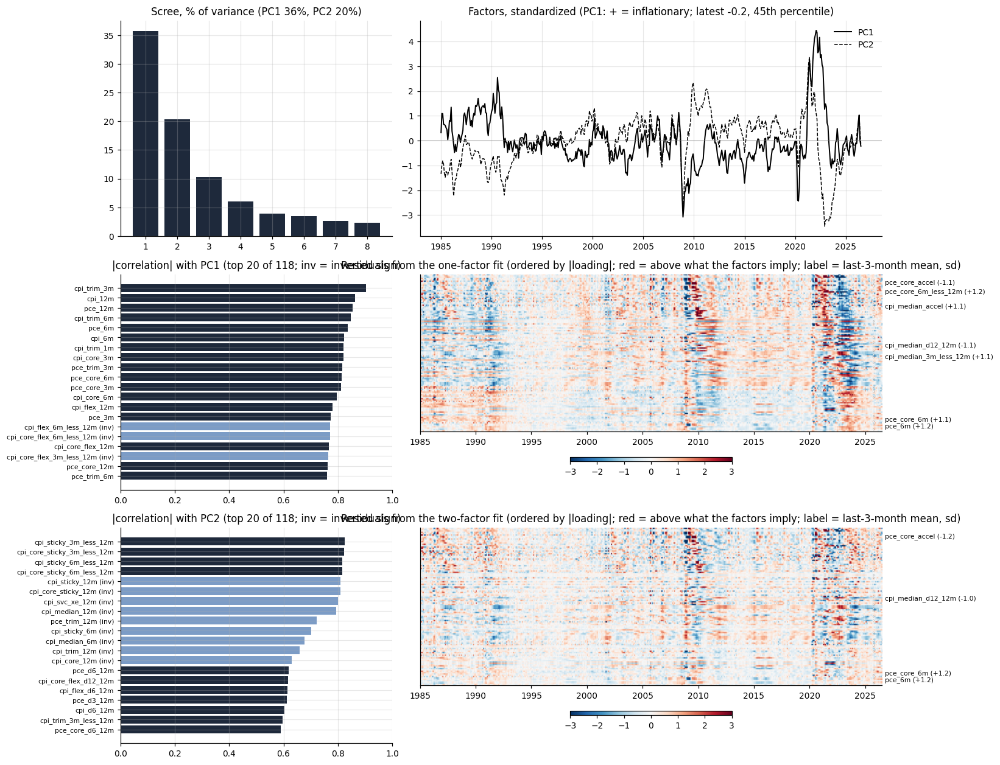
*Block 1, inflation measures*

PC1 is the general inflation factor, comoving positively with all inflation measures and correlating most strongly with recent core and trimmed-mean measures. It currently sits close to its historical average.

PC2 captures momentum, loading positively on 3m measures and negatively on 12m measures, so it turns negative when inflation is decelerating. It rose with the Iran war and has since returned to average, without yet turning negative.

### Block 2: price-change distribution

*Block 2 universe: 34 CPI expenditure categories (FRED, seasonally adjusted)*

| Group | Categories |
|---|---|
| Food (7) | cereals; meats, poultry, fish, eggs; dairy; fruits and vegetables; other food at home; food away from home; alcohol |
| Energy (4) | gasoline; fuel oil; electricity; utility gas |
| Core goods (12) | men's, women's and infants' apparel; footwear; new and used vehicles; vehicle parts; medical commodities; household furnishings; tobacco; recreation commodities; educational books |
| Services (11) | rent; owners' equivalent rent; lodging away from home; water and sewer; professional medical and hospital services; vehicle maintenance; public transportation; tuition and childcare; personal care; other services |

*Block 2 indicators*

| shorthand | indicator | source | transformation |
|---|---|---|---|
| share_gt{0,2,3,4,5}_{3,6,12}m | share of categories with inflation above 0/2/3/4/5 percent | 34 CPI categories, BLS via FRED | count divided by categories available; computed on annualized 3/6/12-month category inflation |
| share_accel_{3,6,12}m | share of categories accelerating | 34 CPI categories, BLS via FRED | h-month rate above the 12-month rate (at h = 12: above the 12-month rate a year earlier); computed on annualized 3/6/12-month category inflation |
| share_decel_{3,6,12}m | share of categories decelerating | 34 CPI categories, BLS via FRED | as above, below; computed on annualized 3/6/12-month category inflation |
| xs_sd_{3,6,12}m | cross-sectional standard deviation | 34 CPI categories, BLS via FRED | across categories; computed on annualized 3/6/12-month category inflation |
| xs_iqr_{3,6,12}m | interquartile range | 34 CPI categories, BLS via FRED | 75th minus 25th percentile across categories; computed on annualized 3/6/12-month category inflation |
| xs_p90_p10_{3,6,12}m | 90-10 spread | 34 CPI categories, BLS via FRED | 90th minus 10th percentile; computed on annualized 3/6/12-month category inflation |
| xs_skew_{3,6,12}m | cross-sectional skewness | 34 CPI categories, BLS via FRED | computed on annualized 3/6/12-month category inflation |
| xs_median_{3,6,12}m | median category inflation | 34 CPI categories, BLS via FRED | computed on annualized 3/6/12-month category inflation |
| upper_tail_share_{3,6,12}m | upper-tail share | 34 CPI categories, BLS via FRED | share of the sum of absolute category inflation coming from the top decile; computed on annualized 3/6/12-month category inflation |

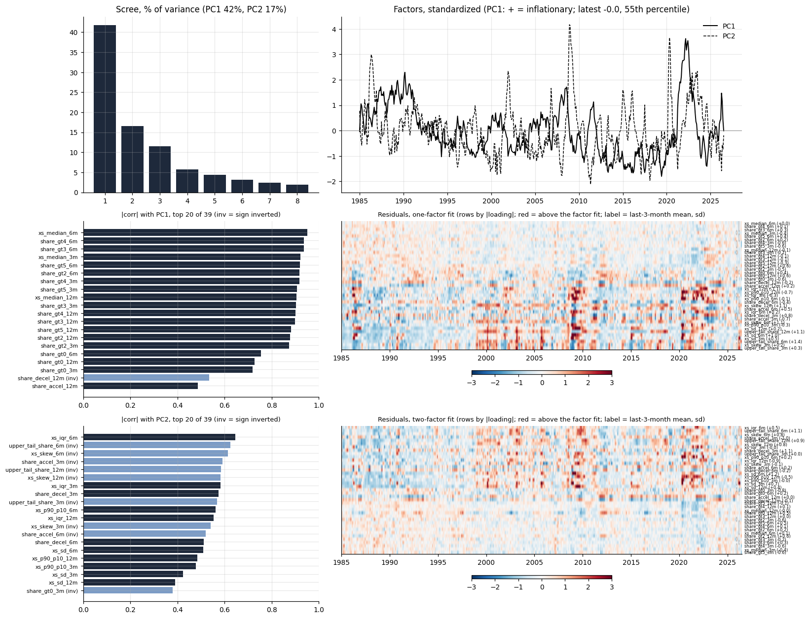
*Block 2, price-change distribution*

PC1 is the breadth factor, comoving positively with the share of categories rising quickly and with median category inflation, and correlating most strongly with the 6-month measures. Breadth spiked to +1.5 standard deviations three months ago and has since returned to average.

PC2 separates wide two-sided dispersion from right-tailed concentration, loading positively on the interquartile range and negatively on skewness and the upper-tail share, so it turns negative when a few categories are accelerating rather than the whole distribution shifting. It ran close to -1.5 through the middle of the year, possibly reflecting energy and tariff-related passthrough, and has since returned to average.

### Block 3: inflation expectations

*Block 3 indicators*

| shorthand | indicator | source | transformation |
|---|---|---|---|
| mich_1y | Michigan 1-year expected inflation, median | Michigan survey via FRED | level, percent |
| clev_1y | Cleveland Fed 1-year expected inflation | Cleveland Fed via FRED | level |
| clev_10y | Cleveland Fed 10-year expected inflation | Cleveland Fed via FRED | level |
| bei_5y | 5-year breakeven inflation | Treasury via FRED | monthly mean of daily |
| bei_10y | 10-year breakeven | Treasury via FRED | monthly mean |
| bei_5y5y | 5y5y forward breakeven | Treasury via FRED | monthly mean |
| spf_cpi_4q | SPF median CPI forecast, next four quarters | Philadelphia Fed SPF (not on FRED) | mean of the individual CPI2-CPI5 forecasts, median across forecasters; quarterly spread to months |
| spf_cpi_4q_iqr | SPF cross-sectional IQR of the 4-quarter forecast | Philadelphia Fed SPF | 75th minus 25th percentile across forecasters |
| spf_cpi_4q_sd | SPF cross-sectional SD of the 4-quarter forecast | Philadelphia Fed SPF | across forecasters |
| spf_cpi_10y | SPF median 10-year CPI forecast | Philadelphia Fed SPF | quarterly spread to months |

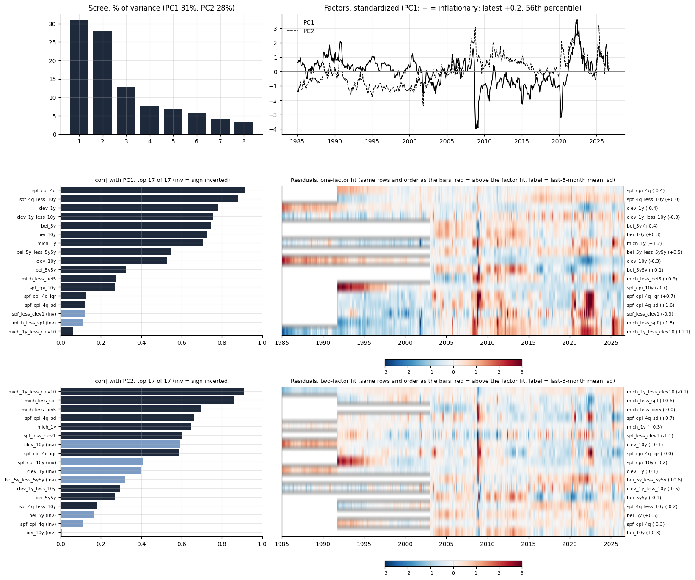
*Block 3, expectations*

PC1 is the level of expected inflation, comoving positively with every source and correlating most strongly with the Cleveland Fed measures and the SPF one-year forecast. It currently sits close to its historical average.

PC2 is the wedge between near-term disagreement and long-run expectations, loading positively on forecaster dispersion and household expectations and negatively on the 10-year measures, so it turns positive when households and near-term forecasters run ahead of the long-run view. It sits modestly above average, having partially unwound its spike earlier in the year.

### Block 4: demand and labor

*Block 4 indicators*

| shorthand | indicator | source | transformation |
|---|---|---|---|
| unrate | Unemployment rate | BLS via FRED | level, percent |
| payrolls_3m / payrolls_12m | Nonfarm payrolls | BLS via FRED | annualized 3- and 12-month log growth |
| claims_log | Initial claims | DOL via FRED | log of the monthly mean of weekly claims |
| vu_ratio | Job openings to unemployed | BLS JOLTS via FRED | ratio |
| quits | Quits rate | BLS JOLTS via FRED | level, percent |
| ahe_3m / ahe_12m | Average hourly earnings, production workers | BLS via FRED | annualized 3- and 12-month log growth |
| eci_wages_yoy | ECI wages and salaries | BLS via FRED | year-on-year percent, quarterly spread to months |
| comp_12m | Compensation of employees | BEA via FRED | 12-month log growth |
| real_pce_6m / real_pce_12m | Real PCE | BEA via FRED | annualized 6- and 12-month log growth |
| real_retail_6m | Real retail sales | Census via FRED | annualized 6-month log growth |
| ip_6m / ip_12m | Industrial production | Fed via FRED | annualized 6- and 12-month log growth |
| capu | Capacity utilization | Fed via FRED | level, percent |
| real_inv_yoy | Real gross private domestic investment | BEA via FRED | year-on-year, quarterly spread to months |
| gdp_yoy | Real GDP | BEA via FRED | year-on-year, quarterly spread to months |
| sentiment | Michigan consumer sentiment | Michigan via FRED | level |

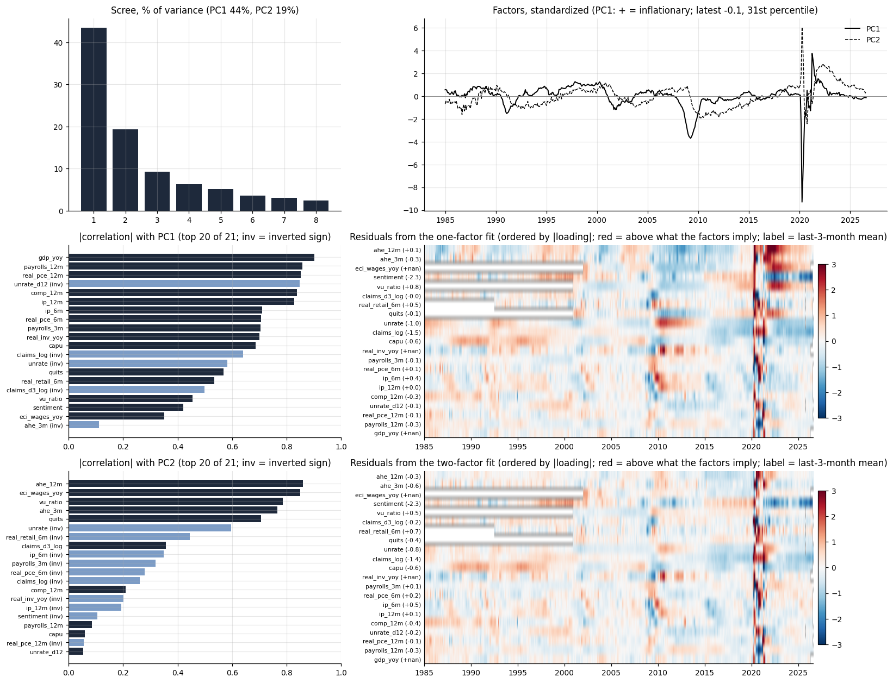
*Block 4, demand and labor*

PC1 is the standard business-cycle factor, comoving positively with output, employment and real spending growth, and correlating most strongly with year-on-year GDP and compensation growth. Activity sits a little below its historical average.

PC2 is the wage-pressure factor, loading positively on wage growth, the vacancy-unemployment ratio and quits and negatively on unemployment, so it turns positive when the labor market is tight relative to activity. It remains above average, though it has drifted down steadily over the year.

### Block 5: financial conditions and risk pricing

*Block 5 indicators*

| shorthand | indicator | source | transformation |
|---|---|---|---|
| fedfunds | Effective federal funds rate | Fed via FRED | monthly mean, percent |
| dgs2 / dgs10 | 2- and 10-year Treasury yields | Treasury via FRED | monthly mean of daily |
| real_10y_tips | 10-year TIPS yield | Treasury via FRED | monthly mean |
| real_10y_clev | 10-year real rate | derived | 10-year yield minus Cleveland Fed 10-year expected inflation (the expectation is in block 3, so this is not a within-block difference) |
| nfci / anfci | Chicago Fed NFCI and adjusted NFCI | Chicago Fed via FRED | monthly mean; positive = tighter |
| vix | VIX | Cboe via FRED | monthly mean |
| baa_spread | Moody's Baa yield minus 10-year Treasury | FRED (published spread) | monthly mean |
| gz_spread / ebp | Gilchrist-Zakrajsek spread and excess bond premium | Federal Reserve (not on FRED) | level |
| term_premium_10y | Kim-Wright 10-year term premium | Fed via FRED | monthly mean |
| equity_3m_ret / equity_12m_ret | Nasdaq composite | FRED | 3- and 12-month log return (the S&P 500 on FRED covers ten years only) |
| usd_12m | Broad dollar index | Fed via FRED | 12-month log change; 1973-2019 and 2006- indexes spliced at the overlap |
| oil_3m / oil_12m | WTI crude oil | FRED | 3- and 12-month log change |
| ppi_comm_12m | PPI all commodities | BLS via FRED | 12-month log change |
| sloos_ci | SLOOS net share tightening C&I standards | Fed via FRED | quarterly spread to months |
| mortgage30 | 30-year mortgage rate | Freddie Mac via FRED | monthly mean |

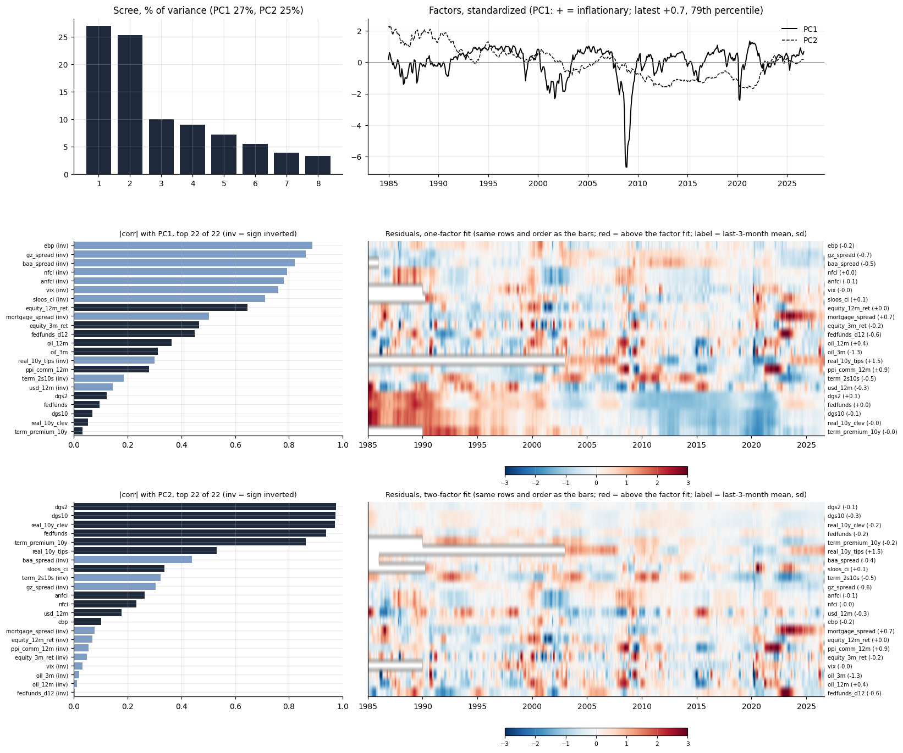
*Block 5, financial conditions (+ = looser)*

PC1 is the common factor of interest rates, inverted so that positive implies looser financial conditions, and correlating most strongly with the mortgage rate, the 10-year real rate and the 10-year Treasury yield. Rates sit at about their historical average.

PC2 is the risk-pricing dimension, loading positively on credit spreads, the excess bond premium, the VIX and the NFCI, so it turns positive when financial stress is elevated. It sits well below average: risk pricing is unusually benign.

## 2. A dynamic factor model of the panel

We next combine the five blocks in a dynamic factor model, X = Lambda_G G + lambda_B B + e, allowing two global factors common to the whole panel and one factor specific to each block, with the seven evolving as a joint VAR(1) and each series carrying an AR(1) idiosyncratic component. We estimate it by expectation-maximization, so the Kalman smoother handles missing observations and the ragged edge directly and no imputation step is needed. Signs are normalized so that every factor is positively related to inflation.

The panel has 141 variables from 1985-01 to 2026-07. EM converged in 84 iterations. Averaged over the series in each block, the two global factors account for dem 17%, dist 44%, exp 26%, fin 23%, infl 74% of the variance, and all seven factors together for dem 48%, dist 55%, exp 33%, fin 30%, infl 77%. Every factor is oriented so that higher = more inflationary pressure (financial: looser) and scaled to unit standard deviation. First-order autocorrelation: G1 0.98, G2 0.97, B_infl 0.78, B_dist 0.96, B_exp 0.99, B_dem 0.94, B_fin 0.99; the largest eigenvalue of the factor VAR is 0.99, so the system is stationary.

G1 is the common inflation level: it loads most heavily on the SPF one-year forecast and on trimmed-mean CPI and PCE at 3 and 6 months, and accounts for roughly three quarters of the variance of the average inflation series. G2 is a relative-price state rather than a demand state: it loads on flexible-price CPI, the upper-tail share of the category distribution and commodity PPI, so it rises when a narrow set of volatile prices moves rather than the whole distribution.

The block factors are what remains in each block once the two global states are accounted for:

- B_infl: 1-month core and flexible-price deviations, inverted and weakly loaded; it lifts the share of inflation-block variance explained from 74 to 77 percent, so it adds little the global states do not already carry.
- B_dist: dispersion across categories, loading on the cross-sectional standard deviation and the 90-10 spread.
- B_exp: near-term disagreement against long-run anchoring, positive on SPF dispersion and negative on the Cleveland and SPF 10-year expectations.
- B_dem: the business cycle, loading on year-on-year GDP, real consumption and industrial production. It is not a labor-market tightness factor: wages and the vacancy-unemployment ratio load on the second principal component of the block, which the model does not carry.
- B_fin: the level of interest rates, inverted, loading on the 10-year real rate, the 10-year yield and the term premium.

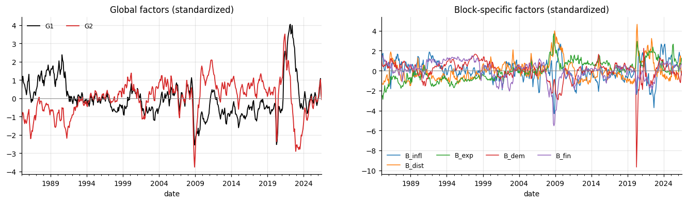
*Global and block-specific factors.*

### Forecasts

Core PCE is running at 3.3 percent over 12 months and 3.0 annualized over the latest 3 months. The model's forecast of the next eight quarters, annualized, is 2.49, 2.33, 2.30, 2.32, 2.35, 2.37, 2.39, 2.41. Combined with the months already realized, the 12-month rate is projected at 3.3 / 2.9 / 2.4 / 2.4 percent 3/6/12/24 months from now. Within a year the window still contains realized months, so the near-term path is largely arithmetic: the quarters ending January and April 2026 ran at 3.8 and 3.8 annualized, and the 12-month rate falls as they roll out.

*Projected 12-month core PCE inflation at each horizon, origin July 2026 (percent)*

|  | 3m | 6m | 12m | 24m |
|---|---|---|---|---|
| forecast | 3.27 | 2.91 | 2.36 | 2.38 |
| change vs current 12m | -0.02 | -0.38 | -0.93 | -0.91 |
| realized months in window | 9 | 6 | 0 | 0 |

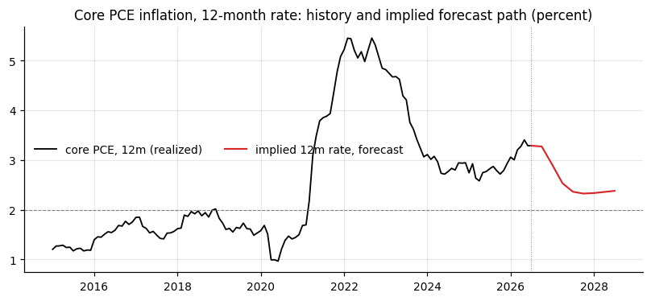
*Implied 12-month core PCE inflation every three months, to 24 months ahead. Windows ending within a year of the origin still contain realized quarters.*

### Sources of news in the current projection

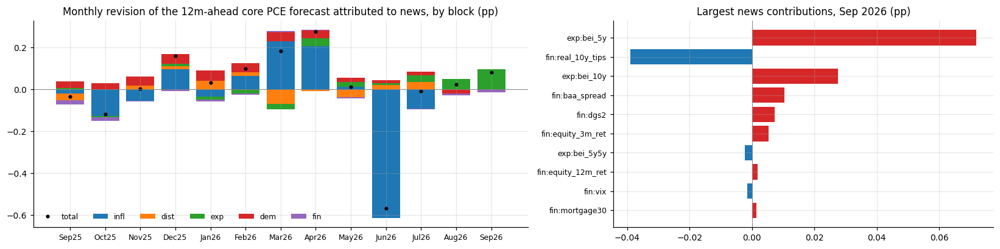
*Monthly news contributions to the current 12-month-ahead forecast, by block.*

Holding the target date fixed at July 2027, each month's data releases revise the 12-month forecast. Over the last 12 months the cumulative revision is +0.30 pp: dem -0.12, exp +0.06, fin +0.08, dist +0.08, infl +0.20. News is measured against the previous month's information set with the parameters held fixed.

### Information sets

How much of the projection depends on the breadth of the panel? Three nested information sets, all iterated: M1 an AR(12) on monthly core PCE chosen by AIC; M2 the two global factors; M3 the global and block factors. M2 and M3 are separately estimated dynamic factor models, since the parameters of a restricted set cannot be read off the full fit. Forecasts are recursive from 2000: at each origin the filtered state uses data through that month only, but the parameters are estimated once on the full sample, which is a look-ahead that favours the factor models. Latest-vintage data throughout, so revisions are ignored.

*Projected 12-month core PCE inflation by information set, origin July 2026 (percent)*

|  | 3m | 6m | 12m | 24m |
|---|---|---|---|---|
| M1 time series | 3.48 | 3.31 | 3.12 | 2.85 |
| M2 global factors | 3.34 | 3.06 | 2.72 | 2.73 |
| M3 global + block | 3.27 | 2.91 | 2.36 | 2.38 |

*Pseudo-out-of-sample RMSE of the 12-month rate h months ahead, 2000 onward, 316 origins at 3m; forecasts accumulated from the 3-month rate. Within a year the window contains realized months, so errors are mechanically smaller at short horizons*

| model | RMSE 3m | RMSE 6m | RMSE 12m | RMSE 24m | relative to M1 3m | relative to M1 6m | relative to M1 12m | relative to M1 24m |
|---|---|---|---|---|---|---|---|---|
| M1 time series | 0.22 | 0.37 | 0.73 | 0.97 | 1.00 | 1.00 | 1.00 | 1.00 |
| M2 global factors | 0.24 | 0.43 | 0.89 | 1.19 | 1.10 | 1.16 | 1.22 | 1.22 |
| M3 global + block | 0.24 | 0.42 | 0.83 | 1.12 | 1.10 | 1.13 | 1.14 | 1.15 |

*The same evaluation reading each h-month rate off its own series instead of accumulating; the gap is the cost of ignoring the accounting identity*

| model | 3m | 6m | 12m | 24m |
|---|---|---|---|---|
| M1 time series | 0.22 | 0.37 | 0.73 | 0.97 |
| M2 global factors | 0.24 | 0.41 | 0.82 | 1.14 |
| M3 global + block | 0.24 | 0.40 | 0.79 | 1.12 |

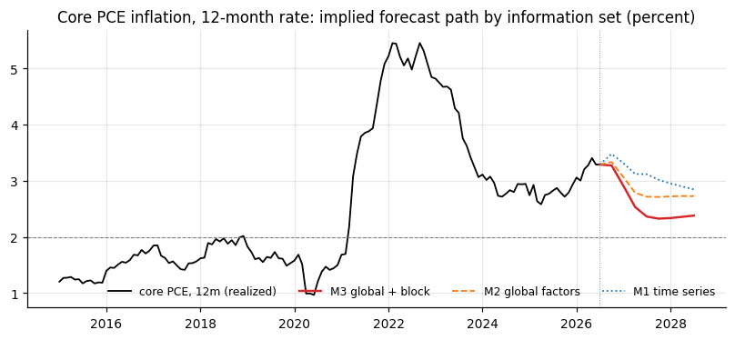
*Implied 12-month core PCE inflation under each information set. Paths coincide over the first quarter, where nine of twelve months are realized, and diverge as the forecast share of the window grows.*

## 3. Agreement, disagreement and historical analogs

Do today's indicators agree about inflation more or less than they usually do? Four complementary measures are used.

The five block factors share one common state that explains 60 percent of their joint variance. Its correlation with each block is infl +0.92, dist +0.84, exp +0.90, dem +0.46, fin -0.64: the blocks do not all move together. The common state stands at +0.01 standard deviations (48th percentile). Relative to what it implies, no block is unusually strong; none unusually weak. Disagreement, the root mean square of these residuals, is 0.11, the 0th percentile of its history.

*Block factors, July 2026: level, what the common state implies, and the residual*

|  | correlation with common state | current level (z) | implied by common state | residual (z) |
|---|---|---|---|---|
| infl | 0.92 | -0.03 | 0.01 | -0.04 |
| dist | 0.84 | -0.01 | 0.01 | -0.02 |
| exp | 0.90 | 0.19 | 0.01 | 0.18 |
| dem | 0.46 | -0.15 | 0.00 | -0.15 |
| fin | -0.64 | 0.07 | -0.01 | 0.08 |

*Disagreement measures, current value and history*

|  | current | percentile | median | p90 |
|---|---|---|---|---|
| D_res: residual RMS | 0.11 | 0.40 | 0.46 | 0.81 |
| D_sd: SD across blocks | 0.13 | 0.20 | 0.81 | 1.29 |
| D_infl_12m: SD across 12m measures | 0.90 | 53.46 | 0.84 | 2.15 |
| D_infl_3m: SD across 3m measures | 1.27 | 41.95 | 1.39 | 3.25 |

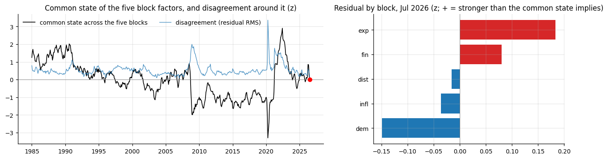
*Common state across the block factors, and the current residual by block.*

### Historical analogs

When in the past did the configuration of inflation signals look most like today?

Cosine similarity between today's vector of block residuals (infl -0.04, dist -0.02, exp +0.18, dem -0.15, fin +0.08), the part of each block not explained by the common state, and every past month, excluding the last 24 months and keeping at most one match per six-month window. Ranked by absolute similarity, so that a mirror image of today's pattern counts as well as a match, the three closest are May 1993 (+0.97), July 2006 (+0.96), December 2015 (-0.90, mirror); in each, core PCE twelve months later was 2.1, 2.0, 1.8 against 2.8, 2.5, 1.2 at the time. Not causal.

Matching on the residuals asks when the five blocks last departed from their common state in the same pattern as today: expectations above what the common state implies, demand below it, financial conditions looser. Ranked by absolute similarity, the three closest are May 1993 and July 2006, which share the pattern, and December 2015, which is its mirror image: expectations below the common state, demand above it, financial conditions tighter. One caveat first: today's residual vector is the smallest in the sample, a quarter of the typical month, so the match is on the direction of a small departure; the analogs' residuals were two to three times larger. July 2006 is the closest economic match. It sat at the end of an energy shock, with flexible-price inflation at 6.7 percent, headline near a point above core, household expectations at 3.2 percent against professionals at 2.8, unemployment at 4.7 percent, and the funds rate at 5.25 at the end of a tightening cycle. Today has the same shape: headline 3.6 against core 3.3, flexible prices at 4.7, Michigan 4.2 against an SPF of 2.4, unemployment 4.1, and the Iran-war oil spike behind the relative-price global factor at its 82nd percentile. In 2006 the shock did not pass into core: twelve months on, core PCE was 2.0, and 2.2 two years on. May 1993 shares the residual pattern but not the economics: oil was flat, headline sat below core, households expected less inflation than professionals, and the economy was in a post-recession disinflation a year ahead of the 1994 tightening. December 2015 is the reverse relative-price shock. Oil had fallen 47 percent over the year, flexible prices were falling at 4 percent, headline was 0.4 against core 1.2, household and long-run expectations were at lows, and the Fed had just made its first increase from zero. As that shock faded, core drifted up, from 1.2 to 1.8 twelve months later. Read as a mirror, it says that a fading energy spike lets core drift down, which is what the factor model projects. The differences today matter more than the similarities: core is 3.3 against 2.5 to 2.8 in the two matches and runs a full point above trimmed PCE where they showed at most a quarter point; the household-professional wedge, at 1.9 points, is wider than in any of the three, and SPF dispersion is the highest of the four; payroll growth is the weakest at 0.2 percent; and the oil spike has already reversed, down 22 percent over three months.

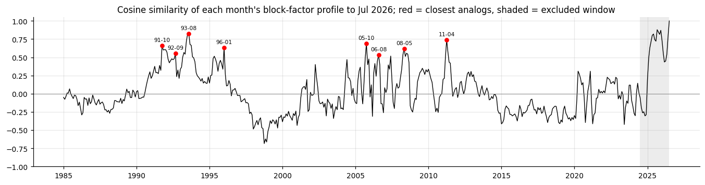
*Cosine similarity of the historical block residual pattern to today's.*

*The three closest analogs by cosine similarity of the block residual pattern, with today for comparison (residuals in z units, + = stronger than the common state implies)*

|  | cosine | pattern | infl | dist | exp | dem | fin | magnitude ratio | core PCE 12m then | next 3m | next 6m | next 12m | change 12m ahead | D_res then |
|---|---|---|---|---|---|---|---|---|---|---|---|---|---|---|
| 1993-05 | 0.97 | same | -0.04 | -0.08 | 0.40 | -0.22 | 0.25 | 2.10 | 2.82 | 1.96 | 2.12 | 2.11 | -0.71 | 0.24 |
| 2006-07 | 0.96 | same | -0.11 | -0.02 | 0.30 | -0.14 | 0.15 | 1.51 | 2.51 | 2.17 | 2.26 | 2.02 | -0.49 | 0.17 |
| 2015-12 | -0.90 | mirror | 0.22 | -0.20 | -0.39 | 0.43 | -0.18 | 2.67 | 1.18 | 1.97 | 2.02 | 1.75 | 0.57 | 0.30 |
| 2026-07 (today) | 1.00 | today | -0.04 | -0.02 | 0.18 | -0.15 | 0.08 | 1.00 | 3.29 |  |  |  |  |  |
